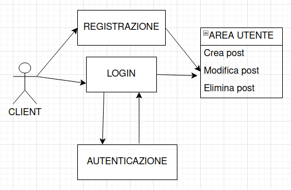
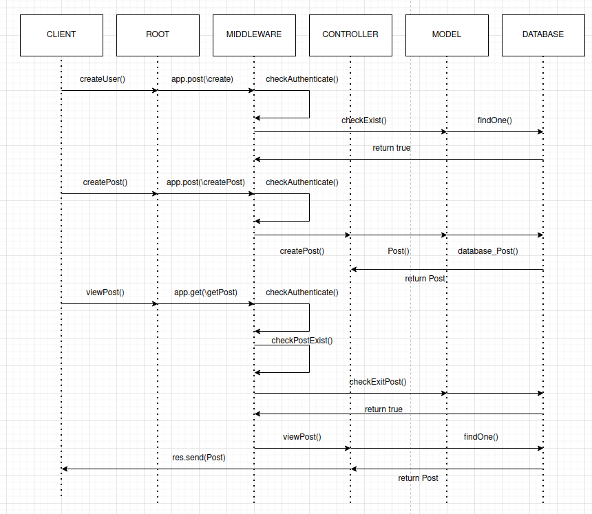
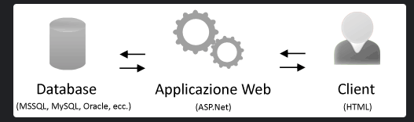
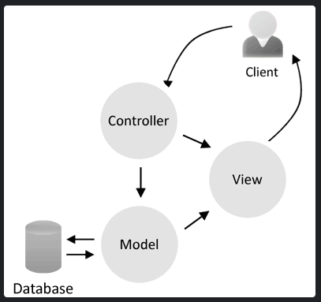

# Blog con Node.js, Express, TypeScript, MySQL e Docker su Ubuntu 20.04 (SOLO LATO BACKEND-PROGETTO INCOMPLETO)

## Express 


è un framework web per Node.js che semplifica lo sviluppo di applicazioni web e API. È noto per la sua flessibilità e velocità, permettendo agli sviluppatori di gestire facilmente le richieste HTTP, il routing, i middleware e altro ancora. Express è estremamente modulare e offre una vasta gamma di moduli aggiuntivi per estendere le sue funzionalità di base.

## Node.js


Node.js è un framework JavaScript open-source che consente di eseguire codice JavaScript lato server. È basato sul motore JavaScript V8 di Google Chrome e consente agli sviluppatori di utilizzare JavaScript per sviluppare applicazioni back-end, non solo per il front-end.

## Sequelize 

                                                        
è un ORM (Object-Relational Mapping) per Node.js che semplifica l'interazione con i database relazionali come PostgreSQL, MySQL e SQLite. Con Sequelize, gli sviluppatori possono utilizzare oggetti JavaScript per eseguire query e manipolare dati, eliminando la necessità di scrivere query SQL manualmente. Offre funzionalità avanzate come migrazioni del database, gestione delle transazioni e definizione delle relazioni tra tabelle.

 ## dotenv 
è un modulo per Node.js che permette di caricare variabili d'ambiente da un file .env all'interno dell'applicazione. È particolarmente utile per gestire configurazioni sensibili come chiavi API, password del database e altre variabili che possono variare tra gli ambienti di sviluppo, test e produzione. Utilizzare dotenv aiuta a mantenere sicure le informazioni sensibili separandole dal codice sorgente e facilitando la configurazione dell'applicazione.

## TypeScript
è un linguaggio di programmazione open-source sviluppato da Microsoft, che estende JavaScript aggiungendo tipizzazione statica opzionale. Con TypeScript, gli sviluppatori possono dichiarare i tipi di dati per variabili, parametri di funzioni, ritorni di funzioni e altro ancora. Questo aiuta a individuare errori durante il processo di sviluppo, migliorando la manutenibilità, la leggibilità e la scalabilità del codice. TypeScript è compatibile con JavaScript esistente e può essere utilizzato per lo sviluppo di applicazioni front-end e back-end, inclusi i progetti Node.js.


##  Middleware per l'autenticazione dell'utente
I middleware in Express sono funzioni che hanno accesso all'oggetto di richiesta (request), all'oggetto di risposta (response) e alla funzione di callback next(). Sono fondamentali per l'elaborazione delle richieste HTTP in Express. I middleware possono eseguire diverse azioni durante il ciclo di vita di una richiesta, come l'autenticazione, la gestione degli errori, la registrazione delle richieste, la gestione delle sessioni e molto altro ancora.
```bash
const authenticateUser = (req, res, next) => {
  // Simuliamo un controllo di autenticazione dell'utente
  const isLoggedIn = checkIfUserIsLoggedIn(req); // Funzione per verificare se l'utente è autenticato

  if (isLoggedIn) {
    // Se l'utente è autenticato, passa il controllo al middleware successivo
    next();
  } else {
    // Se l'utente non è autenticato, reindirizzalo alla pagina di login
    res.redirect('/login');
  }
};
```
Funzione di verifica se l'utente è autenticato (da sostituire con la tua logica di autenticazione effettiva)
```bash
const checkIfUserIsLoggedIn = (req) => {
  // Esempio di logica di autenticazione: controlla se esiste un flag 'isLoggedIn' nell'oggetto della richiesta
  return req.session.isLoggedIn; // Esempio di verifica tramite sessione (assumendo che tu utilizzi sessioni)
};
```
Utilizzo del middleware per proteggere una route
```
app.get('/area-riservata', authenticateUser, (req, res) => {
  res.send('Benvenuto nell\'area riservata!');
});
```
# Use Case & UML
Lo use case e uml non corrispondono al progetto ma danno un idea degli sviluppi futuri da migliorare: 




# Rotte disponibili nell'applicazione

- `/`: Route della home page. Questo percorso visualizza la home page del blog.

- `/database`: Route per visualizzare il database. Questo percorso consente di accedere all'area per visualizzare i dati nel database.

- `/login`: Route per l'autenticazione. Questo percorso reindirizza gli utenti alla pagina di login o registrazione.

- `/crea`: Route per l'area di creazione. Questo percorso consente di accedere all'area per creare nuovi contenuti.

- `/utente`: Route per l'area utente. Questo percorso reindirizza gli utenti all'area riservata agli utenti registrati.

- `/amministratore`: Route per l'area amministratore. Questo percorso reindirizza gli utenti all'area riservata agli amministratori del blog.

# Patthern 
Model-View-Controller (MVC) è un pattern utilizzato in programmazione per dividere il codice in blocchi dalle funzionalità ben distinte. Solitamente un applicazione lavora in questo modo :

Quando si parla diell pattern MVC la nostra applicazione lavora in modo differente 
  - Model: contiene i metodi di accesso ai dati.
  - View: si occupa di visualizzare i dati all'utente e gestisce l'interazione fra quest'ultimo e l'infrastruttura sottostante.
  - Controller: riceve i comandi dell'utente attraverso il View e reagisce eseguendo delle operazioni che possono interessare il Model e che portano generalmente ad un cambiamento di stato del View.



## 1. Configurazione Iniziale

Per iniziare il progetto, eseguire il seguente comando per generare un file `package.json` predefinito. Dopo aver mandato in esecuzione il comando verrà creato un file chimato `node_module` che non è stato caricato nel repository perche era troppo grande in termini di spazio di archiviazione :

```bash
npm init -y
```

## 2. Installazione Dipendenze

Installare le seguenti dipendenze per il progetto:

```bash
npm install express typescript @types/node @types/express
```

## 3. Configurazione TypeScript

Creare un file `tsconfig.json` e configurarlo con le seguenti opzioni:

```json
{
  "compilerOptions": {
    "target": "es6",
    "module": "commonjs",
    "outDir": "./dist",
    "strict": true
  }
}
```

## 4. Configurazione Nodemon & TypeScript

Installare Nodemon e ts-node come dipendenze di sviluppo:

```bash
npm install --save-dev nodemon ts-node
```

## 5. Modifica package.json

Modificare il file `package.json` aggiungendo i seguenti script nella sezione "scripts":

```json
"scripts": {
    "test": "echo \"Error: no test specified\" && exit 1",
    "start": "nodemon --exec ts-node index.ts"
}
```

## 6. Installazione MySQL e Sequelize

Installare Sequelize e mysql2 come dipendenze del progetto:

```bash
npm install --save sequelize mysql2
```

## 7. Creazione Connessione MySQL

Seguire la guida su [cloud.it](https://www.cloud.it/tutorial/come-gestire-utenti-e-permessi-con-mysql.aspx) per configurare un utente MySQL. Verificare la connessione al server MySQL con i comandi:

```bash
sudo service mysql start
sudo service mysql status
```

## Installazione di Docker su Ubuntu 20.04

Seguire la guida su [ionos.it](https://www.ionos.it/digitalguide/server/configurazione/installare-docker-su-ubuntu-2004/) per installare Docker su Ubuntu 20.04.

Prima di iniziare l'installazione, assicurarsi che il sistema e tutti i pacchetti siano aggiornati eseguendo i seguenti comandi:

```bash
sudo apt-get update
sudo apt-get upgrade
```

Rimuovere eventuali versioni di anteprima o beta di Docker con i seguenti comandi:

```bash
sudo apt remove docker-desktop
rm -r $HOME/.docker/desktop
sudo rm /usr/local/bin/com.docker.cli
sudo apt purge docker-desktop
```

Aggiungere il repository di Docker al sistema con i seguenti passaggi:

```bash
sudo apt-get install \
    ca-certificates \
    curl \
    gnupg \
    lsb-release

sudo mkdir -p /etc/apt/keyrings
curl -fsSL https://download.docker.com/linux/ubuntu/gpg | sudo gpg --dearmor -o /etc/apt/keyrings/docker.gpg

echo \
  "deb [arch=$(dpkg --print-architecture) signed-by=/etc/apt/keyrings/docker.gpg] https://download.docker.com/linux/ubuntu \
  $(lsb_release -cs) stable" | sudo tee /etc/apt/sources.list.d/docker.list > /dev/null
```

Infine, installare Docker Engine con il seguente comando:

```bash
sudo apt-get install docker-ce docker-ce-cli containerd.io
```

Verificare l'installazione eseguendo il container Docker "Hello World":

```bash
sudo docker run hello-world
```

Questa guida fornisce una procedura dettagliata per configurare un ambiente di sviluppo Node.js con Express, TypeScript, MySQL e Docker su Ubuntu 20.04.
